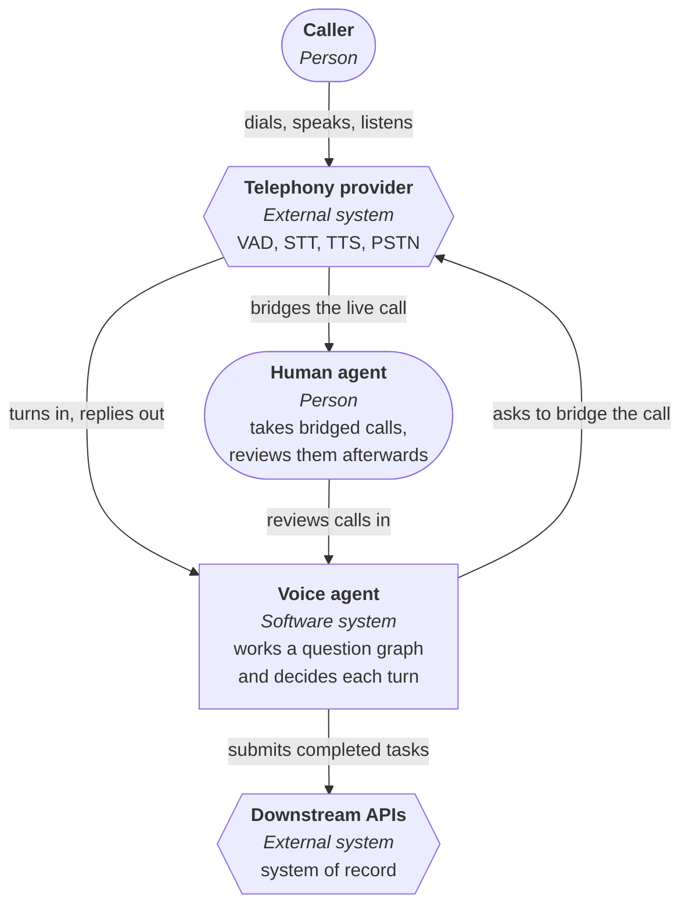
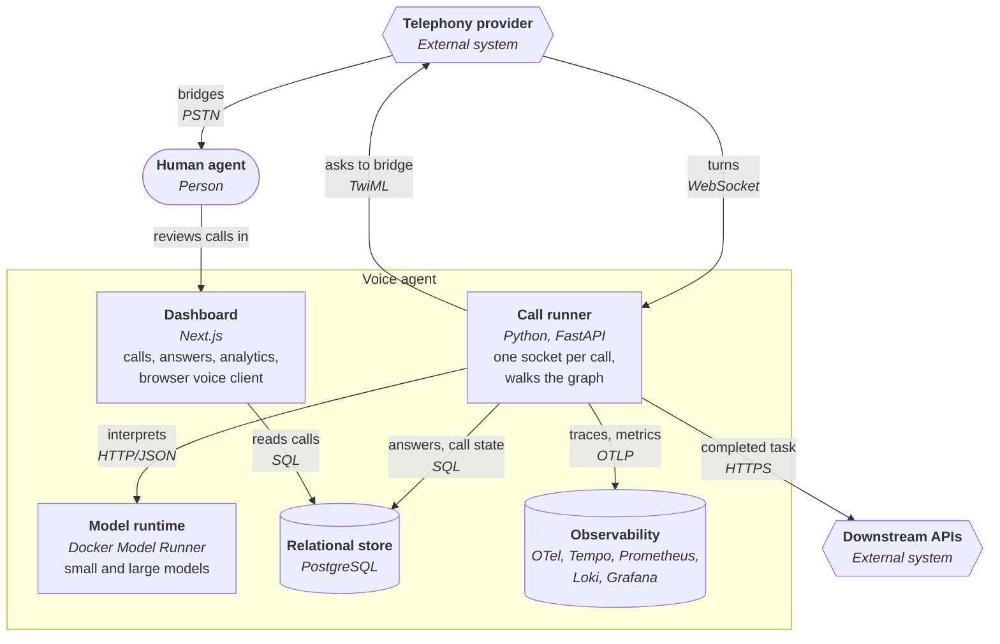
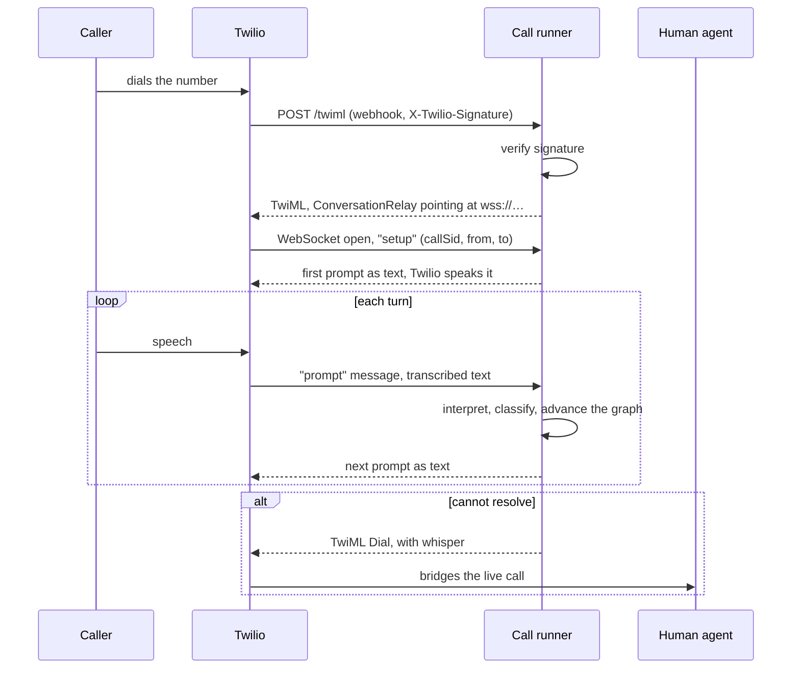

# Twilio inbound voice agent

Someone calls a number, an agent works through a structured question graph with
them, and either completes the task or hands the live call to a person.

Built to find out where a voice agent's latency goes, how much of a turn a small
model can be trusted to decide, and what you have to measure to know any of it
works. For the default path, every layer a commercial stack would rent is
self-hosted instead.

Measured rather than asserted: the interpreter scores 22/24 fully correct at a p50
of about 1.8s per turn on a local model. Two cases fail, are named, and are
[left failing](#checking-the-model-is-any-good).

| Layer | The obvious thing to buy | What runs by default | Swapping back |
|---|---|---|---|
| Speech in and out | Deepgram, ElevenLabs | Browser Web Speech API | `TTS_PROVIDER`, `TRANSCRIPTION_PROVIDER` |
| LLM | AWS Bedrock | [Docker Model Runner](https://docs.docker.com/ai/model-runner/) locally | `LLM_PROVIDER`, `LLM_BASE_URL` |
| Observability | Datadog | OpenTelemetry into Grafana, Tempo, Prometheus, Loki | `OTEL_EXPORTER_OTLP_ENDPOINT` |
| Database | RDS | PostgreSQL in a container | `DATABASE_URL` |
| Hosting | EKS | Docker Compose | [render.yaml](render.yaml) |

Every row is configuration, not a rewrite. Speech vendors sit below the telephony
port of [ADR 1](docs/adr/0001-telephony-behind-a-port-with-two-implementations.md)
and the model behind a base URL, so nothing above either seam builds a provider's
request.

Decisions with a real alternative: **[decision records](docs/adr/)**. Structure and
open questions: **[docs/architecture.md](docs/architecture.md)**. Scope limits:
[at the bottom](#what-this-is-not).

## Running it

You need Docker, and nothing else.

```bash
git clone https://github.com/berTrindade/twilio-inbound-voice-agent-poc
cd twilio-inbound-voice-agent-poc
make up
```

| | |
|---|---|
| Talk to the agent | http://localhost:3000/chat |
| Dashboard | http://localhost:3000 |

A first run pulls about 10 GB of models, 10 to 40 minutes; Ctrl-C is safe and
`make up` resumes. To skip it, put a free [Groq](https://console.groq.com) key in
the generated `.env` and uncomment the four Groq lines.

No login. Type, or click the mic in Chrome or Edge. The chat page suggests the
utterances worth trying, because answering honestly exercises only one of the six
outcomes a turn can land on. The dashboard opens on 400
[example calls](apps/voice-agent/README.md#database), labelled as invented.

`make help` lists the rest. `make observability` adds Grafana, Tempo, Prometheus
and Loki on `:3001`, opening on turn latency against Twilio's published budget.

### Checking the model is any good

```bash
make eval
```

Twenty-four caller utterances through the real interpreter, same prompt builders
and same handler as a live call, scoring whatever `LLM_PROVIDER` is set to. The one
thing here that is not Docker only: needs Python 3.13+ and Poetry, then
`cd apps/voice-agent && poetry install`. `make test` is the same.

```
intent accuracy     22/24   91.7%
fully correct       22/24   91.7%
answer values       11/12   91.7%
guardrail recall     3/3   100.0%
latency p50 / p95   1805ms / 2481ms
```

M3 Max, default local model. Two cases fail and are left failing rather than tuned
away, both named in
**[the eval's README](apps/voice-agent/scripts/llm_eval/README.md)**.

### On a real phone number

Uncomment the two Twilio lines in `.env`, add your auth token and an
`ngrok http 8080` hostname, `make up` again, then point your Twilio number at
`POST https://<hostname>/twiml`. Twilio's AI/ML addendum must be accepted in the
console first, and the failure is silent.

That block also switches the model to Groq. Twilio budget 375ms for the model, so a
local model's 1.8s is over the bar, though a survey holds together because the
caller expects a beat after answering.

Walkthrough, hosted setup, recording, costs, and the fix for a 403:
**[docs/hosting.md](docs/hosting.md)**.

### Swapping the content

Point `SURVEY_JSON_PATH` and `INITIAL_NODE_ID` at your own graph, in place of
`apps/voice-agent/src/voice_agent/survey_data/demo_survey.json`.

## Architecture

The first two [C4](https://c4model.com/) levels, then call setup. Rounded boxes are
people, hexagons are systems this does not run, plain boxes are things it deploys,
cylinders are stores.

### Level 1, system context



The agent never sees raw audio. Telephony owns VAD, speech-to-text and
text-to-speech, so turn boundaries are decided outside this system. The model
provider sits inside the Voice agent box because it is self-hosted.

### Level 2, containers



Every turn lands on exactly one outcome: record an answer, retry, answer a question,
refuse an off-topic one, escalate to the larger model, or hand over to a person.
Handover is a terminal state, not an error path.

### Call setup

Two-phase: an HTTP webhook returns TwiML, and that TwiML tells Twilio to open a
WebSocket back. After that it is turns on one socket.



`callSid` is the correlation ID tying the trace, the stored answers and Twilio's own
call log together. Signature verification is on by default.

Component diagrams, deployment view and technology mapping:
**[docs/architecture.md](docs/architecture.md)**.

## What this is not

A POC, and specific about which parts. Each was a decision to stop, not an oversight.

- **Single replica.** Conversation state is in memory keyed by call id, and the
  socket holds a caller to one process for minutes. Handoff context is the
  exception and is persisted, because the TwiML webhooks that read it address the
  service rather than the process that wrote it.
- **No authentication.** No dashboard login, and the runner trusts anything reaching
  the socket. The webhook does verify Twilio's signature.
- **Every trace is kept.** Fine at this volume, wrong at any real one. Tail sampling
  needs a decision about which calls are worth keeping.
- **Nothing alerts.** Thresholds exist. Nothing routes them.
- **Encryption is optional.** Unset `ENCRYPTION_KEY` silently does nothing, which is
  the wrong default for a security control.
- **One downstream, one survey shape.** A pluggable dispatcher whose only external
  handler is one webhook is an assumed seam, not a proven one.

## Notes

- **Latency.** A container cannot reach the GPU on a Mac.
  [ADR 3](docs/adr/0003-run-the-model-outside-the-container.md) measured 12.8s p50
  per turn in a container against 1.6s through Model Runner, same model, same
  quantisation, same score. That is why the model is not a Compose service.
- **What actually leaves the machine.** Typing: nothing, verified with Wi-Fi off.
  Speaking in Chrome or Edge: audio goes to Google's recogniser, which is what the
  Web Speech API is. A real call: Twilio does the speech at both ends, so text goes
  out and comes back while every decision and stored answer stays local.
- **Token counts read zero** locally, because Model Runner's Ollama-compatible API
  does not return them. Latency is real.
