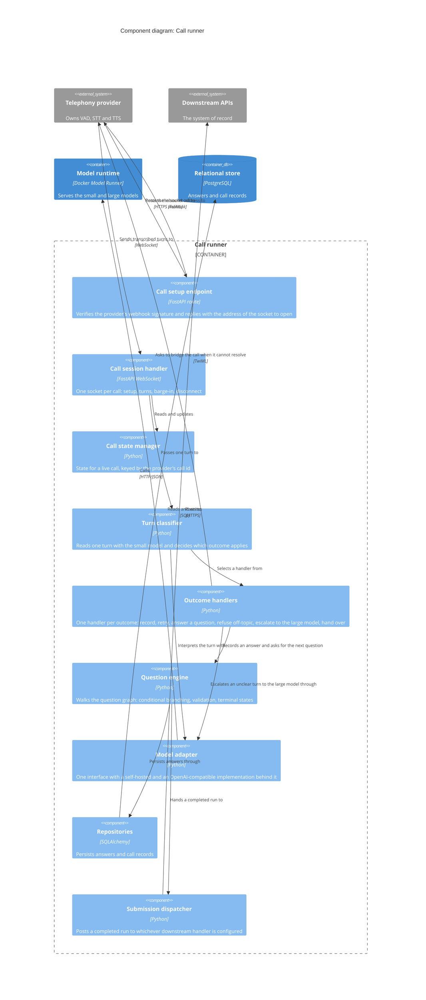
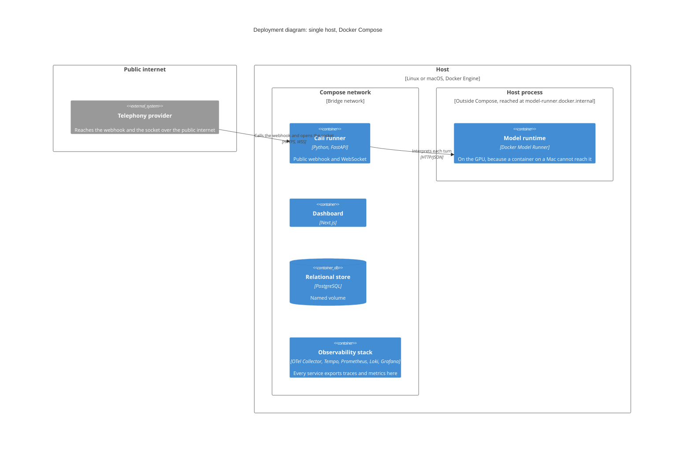

# Architecture

A reference architecture for an inbound voice agent: someone calls a number, an agent works
through a structured question graph with them, and either completes the task or hands the live
call to a person.

The diagrams follow the [C4 model](https://c4model.com/). One level of abstraction each, zooming
in as you go down the page. Element names are roles rather than products, so the shape survives a
provider change. The concrete technology sits in each element's technology field and in
[Technology mapping](#technology-mapping). Every diagram appears in exactly one place: the
[README](../README.md#architecture) carries the two top levels and the call setup sequence, and
this document carries everything below them.

There is no Level 4 (code). C4 treats code diagrams as optional and best generated on demand, and
nothing here is complex enough to earn a hand-maintained one.

## Constraints and drivers

These come first because they shape every box that follows.

- **The agent never sees raw audio.** The telephony layer owns voice activity detection, chunking,
  speech-to-text and text-to-speech. Turn boundaries are decided outside this system, so barge-in
  and end-of-speech are not ours to tune.
- **A turn has a latency budget.** Anything between caller speech and agent speech is on the
  critical path. Work that cannot meet the budget has to move off it.
- **Answers must be attributable.** A call produces structured records, not a transcript to be
  mined afterwards, so extraction is validated deterministically rather than trusted from a model.
- **Giving up is a valid outcome.** Handover to a person is a first-class terminal state, not an
  error path.
- **Self-hosted by constraint.** No managed AI services. The model runtime and the store are
  things we run, which is why they sit inside the system boundary and not behind a port.
- **Personal data must not reach logs**, while traces still have to be good enough to debug a call
  that went wrong.

## Notation key

Applies to every diagram here and in the README.

| Element | Meaning |
|---------|---------|
| `Person` | Someone who uses the system |
| `System` | The software system in focus |
| `System_Ext` | A software system we do not build or run |
| `Container` | A separately deployable, runnable thing: an application or a service |
| `ContainerDb` | A data store we deploy and run |
| `Component` | A grouping of related functionality inside one container. Not separately deployable |
| `Deployment_Node` | Somewhere a container executes |

Every line is one direction, labelled with the intent of the relationship. Lines that cross a
process boundary also carry the protocol.

## Level 3, components

Levels 1 and 2 are in the [README](../README.md#architecture), so this picks up one zoom further
in: the **Call runner**, the only container complex enough to be worth decomposing. Every element
here ships inside that one process.

| Component | Responsibility |
|-----------|----------------|
| **Call setup endpoint** | Prove the request came from the provider, then tell it where to open the socket |
| **Call session handler** | Own the socket for the life of the call and route each inbound message to the right handler |
| **Call state manager** | Hold what the call knows so far, so a turn can be interpreted in context |
| **Turn classifier** | Read one turn cheaply and say what it meant, and not decide what to do about it |
| **Outcome handlers** | Decide what to do about it. Escalating to the larger model is one outcome among several, not a fallback |
| **Question engine** | Walk the graph: conditional branching, handover as a terminal state |
| **Model adapter** | Keep the model seam to one interface so a provider swap does not reach the classifier |
| **Repositories** | The only thing that talks to the relational store |
| **Submission dispatcher** | Deliver the finished record downstream, pluggable per deployment |

The split at the outcome handlers is the part that matters: a turn records an answer, comes back
for a retry, answers the caller's question, refuses an off-topic one, escalates to the larger
model, or gives up and puts a person on the call.

## Deployment view

Everything runs on one host under Docker Compose. This is the whole topology: the self-hosting
constraint means there is no managed service to draw.

This is the view where [ADR 3](adr/0003-run-the-model-outside-the-container.md) shows up as a
shape. The model runtime is in the container diagram and is not a Compose service, because a
container on a Mac cannot reach the GPU and no configuration fixes that. It shares the host, so
its latency is a deployment property rather than an architectural one, and the cost of the
decision is this asymmetry between the two diagrams.

## The three seams

Each external dependency sits behind one port, so a provider is a swap rather than a rewrite.

- **Telephony.** Who answers the call and does VAD, STT and TTS.
- **Model.** Who interprets a turn and who generates a reply.
- **Submission.** Where a completed run is delivered.

The neutral contract across all three is the **turn**: text in, a classified outcome out. Above
the ports, nothing knows which vendor is underneath.

## Technology mapping

What fills each role here. The telephony seam has two implementations, which is what makes it a
real port instead of an aspirational one.

| Role | Reference implementation | Second implementation |
|------|--------------------------|-----------------------|
| Telephony | Twilio ConversationRelay over PSTN | Browser Web Speech API |
| Model | Docker Model Runner, self-hosted | Groq, or any OpenAI-compatible base URL |
| Relational store | PostgreSQL | none |
| Submission | Local handler persisting to Postgres | Any backend, via `SUBMISSION_WEBHOOK_URL` |
| Traces and metrics | OpenTelemetry into Grafana, Tempo, Prometheus, Loki | none |
| Runtime | Docker Compose | none |

## Open questions

Validate these before committing:

- Does interpretation stay two-tier, or collapse to a single model now that larger models are fast
  enough to carry every turn?
- Where is the latency budget spent per turn, and which work belongs off the critical path?
- What is the containment rate, and how is it measured before and after a prompt change?
- How much of "did the caller answer the question" may a model decide, versus a fixed grammar?
- What is the redaction boundary, meaning which fields may appear in a trace at all?
